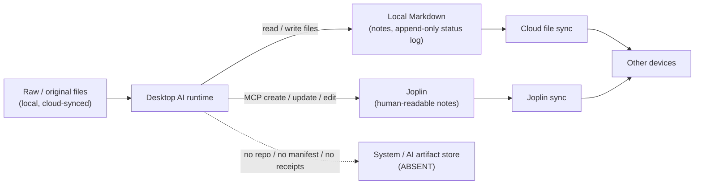
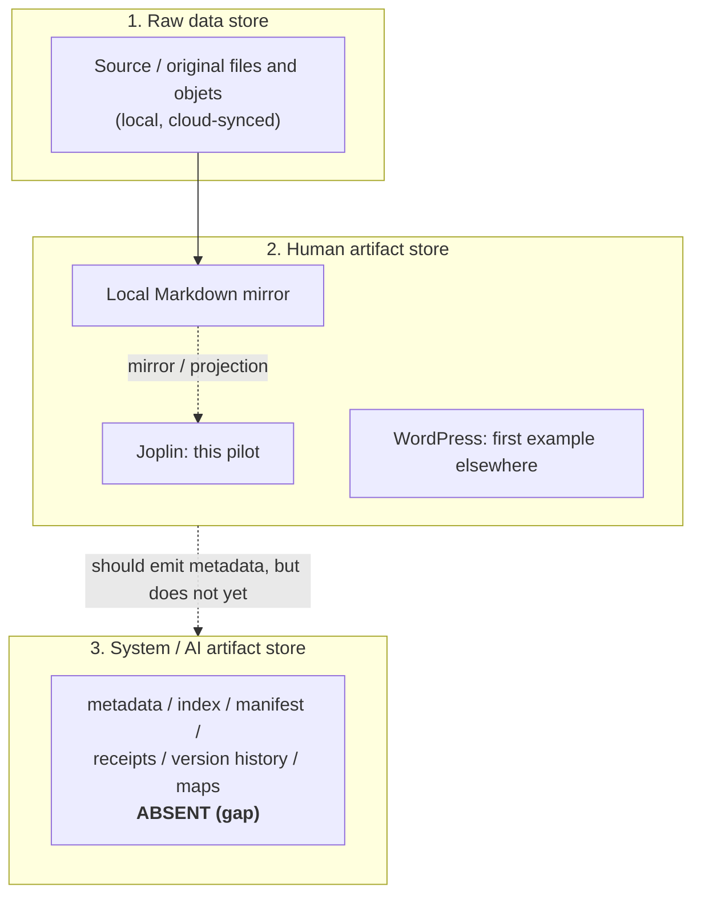

# WOM Pilot Observation: Desktop AI + Joplin As A Human Artifact Store

Work log: 2026-06-08

Status: public planning artifact distilled from a local pilot observation.

Redaction: all identities are role labels and all paths are generic
placeholders. No secrets, tokens, file names, phone numbers, emails, or note
contents are included. The observation remains real, but the public copy keeps
the beta tester role-based.

## 1. Purpose

This is a pilot observation of one pilot user's desktop-AI plus Joplin workflow,
recorded as field evidence for WOM planning. The pilot user runs a desktop AI
runtime that reads and writes local files and operates a Joplin note app.

The purpose is to capture the current, real setup so WOM can design its human
artifact store contract from observed behavior rather than assumption.

- WordPress is already understood as the first user-selected human artifact
  surface example.
- This Joplin setup is a candidate second pilot example.
- WOM should eventually support other existing note, document, and workspace
  apps such as Obsidian, Evernote, Notion, WordPress, and Joplin because not
  every user can build a custom SaaS.

## 2. Observed Current Setup

Only what was actually present in the observed pilot setup is recorded here.

| Aspect | Observed |
| --- | --- |
| AI runtime talking to Joplin | A desktop AI coding agent that reads/writes local files and calls tools. |
| MCP involved? | Yes. A Joplin MCP server exposes note operations such as list notebooks, find/get, create/update/edit. The AI talks to Joplin via MCP, not through the Joplin UI. |
| Cloud sync involved? | Yes. The working folder and raw sources live in a cloud-synced folder, so local artifacts propagate across devices. |
| Where raw/original files live | Local, inside the synced workspace. Exported writings, drive exports, recordings, source documents, and objets are treated as inputs. |
| What Joplin stores | Human-readable notes: structured `note`/`cover` artifacts and readable AI outputs in Markdown. It is a mirror/projection of selected local Markdown. |
| What the AI can read | Local files through filesystem access, Joplin notes through MCP search/get, and its own session transcript. |
| What the AI can write | Local Markdown files and Joplin notes through MCP create/update/edit. Observed constraints: the Joplin MCP cannot attach binaries and cannot delete notes. |
| What Git/GitHub records | Nothing currently. There is no repository, no commit history, and no manifests or receipts. The only versioning is cloud file-sync revisions plus an append-only human-readable status log. |

Additional observation from the project maintainer after the file import:

- The beta tester also created or used a Claude Desktop `/note` skill/command.
- Instead of repeatedly saying "upload everything we have discussed so far to
  Joplin", the beta tester invokes `/note` as a reusable capture action.
- The project maintainer suspects this may be the same mechanism as the earlier
  observation that the beta tester created a template for AI document uploads into
  Joplin. Treat this as a hypothesis to verify, not as confirmed fact.
- The imported pilot file did not explicitly mention `/note`; this is a later
  field observation from the project maintainer during the same pilot sequence.

## 3. Diagram: Current Joplin Flow



The `/note` skill should be understood as a human-facing capture shortcut on
top of this flow:

```text
ongoing discussion
-> user invokes /note
-> Claude Desktop runs a reusable note-capture instruction
-> Joplin note/update is written through the available Joplin path
```

## 4. Diagram: Mapping To The WOM Three-Store Model



## 5. Gap Analysis

Present and working:

- Raw data store: source files exist locally and are cloud-synced.
- Human artifact store: Joplin notes plus local Markdown mirror are present and
  active. The setup includes readable AI outputs, bidirectional citation links
  typed into note bodies, and an append-only human-readable handoff/status log.

Missing or partial:

- System/AI artifact store: essentially absent. What exists are only
  human-readable proxies such as a status log and citation links written inside
  notes. There is no machine-oriented metadata store, no version control,
  no file manifest, no index/map of where things live, no receipts of AI
  actions, and no content hashes.

Plain statement:

The current Joplin setup stores raw data plus human-readable notes only. It does
not have a real system/AI artifact store. The AI must re-scan the filesystem to
orient itself each session.

## 6. Risks And Constraints

- Cloud capacity limits: raw sources plus mirrors grow, and the synced quota is
  finite.
- Local path changes: moving files breaks relative links between notes, and
  recovery is manual.
- Folder renaming: renaming a top-level working folder can break the AI's
  working-tree/session binding and inter-note links.
- AI session/context loss: context does not persist between sessions. The
  current mitigation is a human-readable handoff log, not a machine state
  store.
- No metadata/index/manifest/receipt tracking: there is no authoritative record
  for "what exists, where, which version, and what changed" for the AI to
  consult.
- Treating Joplin as the canonical archive: Joplin is a projection/mirror. The
  local Markdown is the working origin and the raw files are the true sources.
  Treating the projection as source of truth risks silent divergence or loss.

## 7. WOM Design Implications

- Joplin should be one possible human artifact store, not the WOM core.
- WOM must not force a single UI/UX. The user chooses the surface.
- WOM needs a contract/interface that lets WordPress, Joplin, Notion, Obsidian,
  Evernote, or another app serve as a human artifact store. Example operations:
  list, read, write, link, mirror, and project.
- WOM should also notice user-created capture commands such as `/note`. They
  are evidence that users need a low-friction action for "turn the current
  discussion into a durable human artifact" rather than repeatedly typing the
  full instruction.
- A real system/AI artifact store is still required separately: Git/GitHub-style
  metadata, maps, manifests, receipts, version history, and content hashes,
  independent of whichever human surface is chosen.
- The same app name may play different roles. WOM should explicitly distinguish
  and never collapse:
  - source/original app for raw data,
  - human artifact store,
  - system/AI artifact store,
  - projection/publication surface.
- A single tool can occupy more than one role at once. That must be named as
  multiple roles, not treated as one vague app integration.

## 8. Comparison With The WordPress Pilot

The beta tester described the Joplin pilot as better than the earlier WordPress
surface in roughly three ways. Interpreted through the WOM planning model, the
comparison is:

1. Mermaid diagrams are easier to keep visible in the working artifact.

   Joplin is Markdown-centered, and the current pilot already keeps Mermaid
   diagrams directly inside the note/work-log flow. WordPress can display
   diagrams only if the post editor, plugin, theme, or embed path supports that
   rendering. For this pilot, Joplin is therefore a more natural diagram-first
   human artifact store.

2. Citation and cited-by relationships are more explicit.

   The Joplin pilot records bidirectional citation links typed into note
   bodies. This is not yet a machine-oriented WOM index or receipt layer, but
   it is better human-facing linkage than a simple WordPress projection post.
   WOM should treat this as a useful human artifact pattern, then later map it
   into system/AI metadata such as source maps, manifests, or receipts.

3. Report-style artifacts are easier to keep as living notes.

   WordPress can host report-like posts, but the first WordPress pilot is best
   understood as a publication/projection surface. Joplin is closer to a
   workspace note store: the AI can create/update notes through MCP, keep local
   Markdown mirrors, and preserve handoff/status logs as human-readable working
   artifacts. The advantage is not merely "reports can exist"; it is that
   report-style artifacts can live in the same note workflow that the pilot user
   and desktop AI already use.

Planning conclusion:

```text
WordPress pilot = first observed human artifact surface / projection case
Joplin pilot = second observed human artifact store / working-note case
```

Joplin appears better for working diagrams, explicit human citation links, and
living report/handoff notes. It still does not solve the system/AI artifact
store gap by itself.

## 9. `/note` Skill Observation

The project maintainer later observed that the beta tester uses a Claude
Desktop `/note` skill/command in this workflow.

Interpretation:

- `/note` is a local human-facing capture shortcut.
- It may also be a template-bound Joplin upload workflow: the skill likely tells
  Claude how to format and place a note/report when the AI uploads a document
  into Joplin.
- It reduces the repeated prompt burden of saying "summarize or upload the
  discussion to Joplin" every time.
- It standardizes the user's capture ritual: discussion first, then explicit
  durable note capture.
- It is a strong UX signal for WOM: users need simple capture actions that turn
  AI conversation into human artifacts.

WOM design implication:

```text
human conversation with AI
-> explicit capture command
-> human artifact store write
-> optional system/AI artifact metadata write
```

The missing piece is the last step. `/note` appears to write or update the human
artifact store, but it does not by itself create WOM system/AI artifacts such as
manifests, source maps, receipts, content hashes, or Git history.

Verification question for the next inspection:

```text
Is /note only a shortcut command, or does it invoke a specific Joplin upload
template that controls title, sections, citation links, tags/notebooks, and
report format?
```

## 10. Non-Claims

- This document does not implement a Joplin connector.
- This document does not implement cloud or OneDrive sync.
- This document does not publish to WordPress.
- This document does not change any WOM-kit code.
- This is a planning artifact for future implementation only.

## 11. Status / Next

This document is a public-safe planning artifact distilled from a local
beta-tester observation. It remains docs-only unless the project maintainer
explicitly expands the scope.
